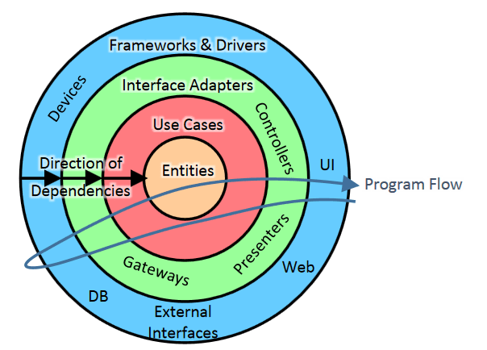

# shopping-cart

A DDD shopping cart application focused on separation of concerns and scalability.

## Philosofy

Main concepts for this architecture are around codebase scalability. The goal is to provide a clean architecture while flexible for implementing and growing functionalities into the codebase.

Everything is highly testable, given low coupling with clear dependency graphs provided by Inversion of Control.

## Architecture



## Folder structure

    .
    └── src
        ├── api # Layer that exposes application to external world (primary adapters)
        │   └── http # Exposes application over HTTP protocol
        ├── app # Layer that composes application use cases
        ├── domain # Business domain classes and everything that composes domain model
        ├── infra # Communication with what is external of application
        └── libs # Common functionalities

## API

### Create an item

POST http://localhost:3000/item

```json
{
  "sku": "AS-1234",
  "displayName": "My first item",
  "price": 100
}
```

### List items

GET http://localhost:3000/item

### Add item to shopping cart

- If shopping cart doesn't exist, it is going to be created.
- If itemId already exists, quantity for existing item in the cart will be increased.

POST http://localhost:3000/cart/1/item

```json
{
  "itemId": "ck0r5ypdz0000ppo73m4o8hfa",
  "quantity": 1
}
```

### Delete item from cart

DELETE http://localhost:3000/cart/1/item/ck0r46c9w0000y9o70hvh605j

### Empty all items for a cart

POST http://localhost:3000/cart/1/clean
